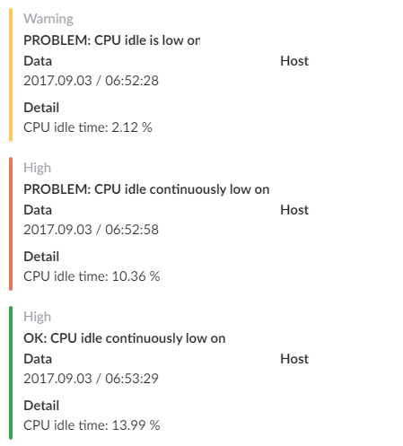
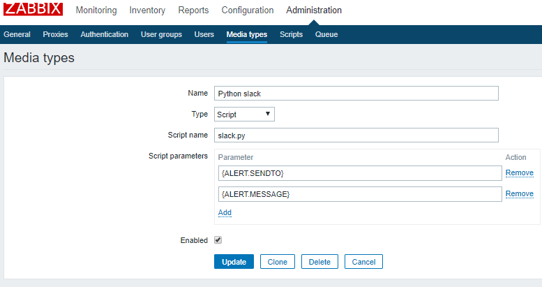
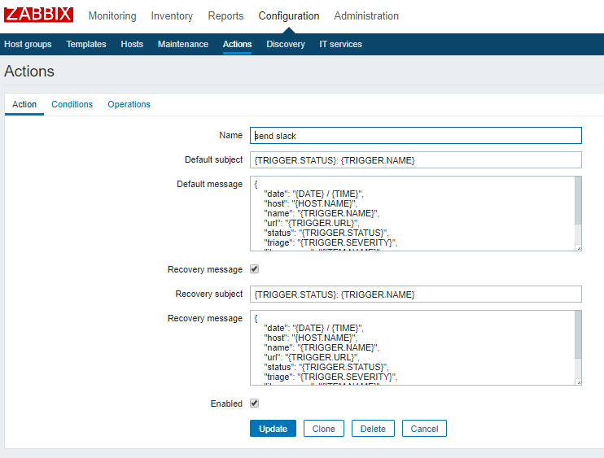
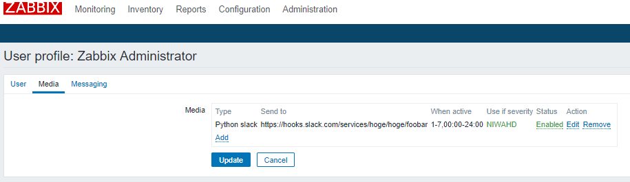

# slack.py

`slack.py` is one of zabbix alertscripts to send alert message for slack without any libraries.



## Requirements

You do not need to install any libraries or packages.

- work on python 2/3

## Usage

### Place this scripts

In generaly, place `slack.py` on `/usr/lib/zabbix/alertscripts/`

### On media types

Set 2 parameters.

- `{ALERT.SENDTO}`
- `{ALERT.MESSAGE}`



### On actions

Set default message.

```json
{
    "date": "{DATE} / {TIME}",
    "host": "{HOST.NAME}",
    "name": "{TRIGGER.NAME}",
    "url": "{TRIGGER.URL}",
    "status": "{TRIGGER.STATUS}",
    "triage": "{TRIGGER.SEVERITY}",
    "item_name": "{ITEM.NAME}",
    "item_value": "{ITEM.VALUE}"
}
```

> `TRIGGER.URL` do not work well. Setting your zabbix dashboard page is recommended.



### On user profile/Media

Set slack media and send to slack [incoming webhook URL](https://api.slack.com/incoming-webhooks).



### Verify

Check your hooked slack channel!!

If it do not work well, you can check how to pass arguments on [Action log](https://www.zabbix.com/documentation/3.0/manual/web_interface/frontend_sections/reports/action_log).

## LICENSE

MIT